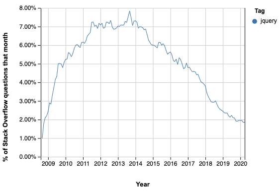

# Web Components

A lo largo de la historia de la web, las librerías y frameworks, han sido siempre las pioneras en cuanto a nueva funcionalidad. Estás nuevas funcionalidades, una vez son adoptas por la comunidad, empiezan a integrarse de forma nativa en los navegadores.

Un ejemplo de esto puede ser la famosa librería jQuery, que fue increiblemente util pero que a día de hoy se sustituye por métodos nativos que encontramos en las especificaciones modernas de JS como `Array.find` y por APIs nativas de los navegadores como `document.querySelector`. Esto hace que cada vez sea menos justificado el peso que añade a nuestro proyecto y sea cada vez menos utilizada.



Actualmente estamos viviendo una adopción similar con los frameworks front-end. Trajeron conceptos innovadores orientados a la componentización y, gracias a su gran popularidad, se han empezado a adoptar de forma de nativa en los navegadores.

Todavía es pronto para predecir el futuro de la web pero parece que la historia se repite porque vemos que las innovaciones de los framework se convierten en un estándar.

Ahora bien, cuando hablamos de Web Components en realidad estamos hablando de un conjunto de APIs que nos expone el navegador y que utilizamos para la creación de componentes nativos.


## Custom Elements

Son bloques de HTML encapsulados y reutilizables resultado de un conjunto de expecificaciones.

### CustomElementRegistry

Es una API del navegador que nos permite registrar nuevas etiquetas HTML que encapsulan nuestra funcionalidad y permite que se repita indefinidamente. Se compone de 3 métodos principales:

- **customElements.define:** se utiliza para registrar un nuevo custom element. Tras registrarlo tendremos un DOM más extenso que reconoce una nueva etiqueta HTML.
- **customElements.whenDefined:** se utiliza cuando queremos realizar acciones tras la definición de un elemento. Devuelve una promesa que se resuelve cuando el elemento ha sido registrado.
- **customElements.get:** se utiliza para acceder al constructor del componente asociado a la etiqueta HTML que le pasemos como argumento.

Esta API del navegador por si sola nos permite crear bloques de funcionalidad reutilizables, parecidos a las directivas de angular.

Puedes ver un ejemplo de implementación en [custom-element-registry.html](../demos/custom-element-registry.html)

### Ciclo de vida

La API de custom elements, como los componentes desarrollados con Angular/React/Vue, expone una serie de "hooks" que podemos utilizar para ejecutar código: 

* **constructor:** Se ejecuta cuando se instancia la clase asociada al componente en el registro. Se suele utilizar para definir el estado inicial del componente.

* **connectedCallback:** Se ejecuta cuando una instancia del componente se ha conectado correctamente al DOM. Se suele utilizar para ejecutar las operaciones iniciales como renderizar contenido y añadir listeners.

* **disconnectedCallback:** Se ejecuta cuando una instancia del componente se desconecta del DOM. Se suele utilizar para eliminar todas las subscripciones activas del componente.

* **attributeChangedCallback:** Se ejecuta cuando uno de los atributos definidos en la propiedad estática `observedAttributes` cambia. Se suele utilizar para reaccionar a cambios producidos desde el exterior.

* **adoptedCallback:** Se ejecuta cuando el componente cambia de documento con el método `adoptNode`. Se utiliza en situaciones puntuales como podría ser la clonación de un componente desde un documento principal a un iframe.

* **attachedCallback (deprecado):** Se ha deprecado en favor de `connectedCallback`, su función es la misma.

* **detachedCallback (deprecado):** Se ha deperecado en favor de `disconnectedCallback`, su función es la misma.

Se puede ver un caso práctico en [app-counter.html](../demos/app-counter.html)


## Shadow DOM

Es una especificación que se incorpora a la API del [DOM (Document Object Model)](DOM (Document Object Model)). Nos permite crear árboles de elementos encapsulados dentro de nuestro documento principal.


Su comportamiento es parecido al de un `iframe` en el sentido de que sus elementos no son directamente accesibles desde el documento padre y sus estilos quedan encapsulados, no afectan al documento padre y viceversa.

Se puede ver un caso práctico en [app-counter.html](../demos/app-counter.html)


## Templates

Es un elemento HTML que permite declarar fragmentos de DOM que se analizan, permanecen inactivos durante la carga de la página y se pueden activar más adelante en el tiempo de ejecución. Son marcadores de posición ideales para declarar la estructura de un elemento personalizado.

```html
<template id="app-root">
  <style>
    b { color: royalblue }
  </style>
  <p>Hello <b>World</b></p>
</template>

<script>
  customElements.define('app-root', class extends HTMLElement {
    constructor() {
      super();
      const shadowRoot = this.attachShadow({ mode: 'open' });
      const $template = document.getElementById('app-root');
      const content = $template.content.cloneNode(true);
      shadowRoot.appendChild(content);
    }
  });
</script>
```

Se puede ver un caso práctico en [app-counter.html](../demos/app-counter.html)


## Custom Events

La API de [custom events](https://developer.mozilla.org/es/docs/Web/Guide/DOM/Events/Creacion_y_Activaci%C3%B3n_Eventos) es anterior a las APIs de web components. Sin embargo, es una de las APIs más importantes porque es la que nos permite comunicar cambios desde el componente al exterior.

Se utiliza para crear eventos que emitimos desde nuestro componente con el método `dispatchEvent`, presente en cualquier elemento HTML.

```javascript
const event = new CustomEvent('event-name', {
  bubbles: true, // Con esta opción el evento se propaga hasta la raíz del DOM
  composed: true, // Con esta opción el evento atraviese las barreras del shadow DOM
  detail: 'Payload del evento'
});

$element.dispatchEvent(event);
```

Se puede ver un caso práctico en [app-counter.html](../demos/app-counter.html)


## Módulos ESM

Es el estándar utilizado para estructurar los proyectos basados en web components V1. La potencia de los módulos se siente sobre todo cuando utilizamos un gestor de paquetes como npm. Esto nos permite tener archivos JS modulares que podemos utilizar en varios proyectos.

_**my-esm-module.js**_

```javascript
export const publicReference = "I can accesed outside this file"
const privateReference = "I cannot be accesed outside this file"
```

_**index.html**_

```html
<!--
	Al importar modulos "esm" tenemos acceso a todas las referencias exportadas
	En este caso podríamos acceder solo a "publicReference"
-->
<script type="module" src="./my-esm-module.js"></script>
<!--
	Podemos implementar fallbacks para naveagadores antiguos utilizando el atributo "nomodule"
	Los navegadores modernos ignoran estos scripts
-->
<script nomodule src="./fallback.js"></script>
```


## Custom Properties

Es la especificación en la que nos basamos para permitir que los componentes que desarrollamos sean personalizables. Esencialmente son variables en CSS, muy parecidas a las variables introducidad en SCSS.

Se utilizan en el desarrollo de componentes web porque atraviesan las barreras del shadow DOM. Esto nos permite influir desde fuera sobre los estilos encapsulados de los componentes de una forma controlada.

También es importante recalcar que las custom properties, a diferencia de las variables de SCSS, se pueden actualizar en tiempo de ejecución.

Para definir una variable utilizamos cualquier nombre prefijado por `--`, por ejemeplo:

```css
  body {
    --primary-color: red;
  }
```

Luego, para utilizarlas tenemos que usar el método `var` de css:

```css
  h1 {
    color: var(--primary-color, royalblue);
  }
```

Se puede ver un caso práctico en [app-counter.html](../demos/app-counter.html)
